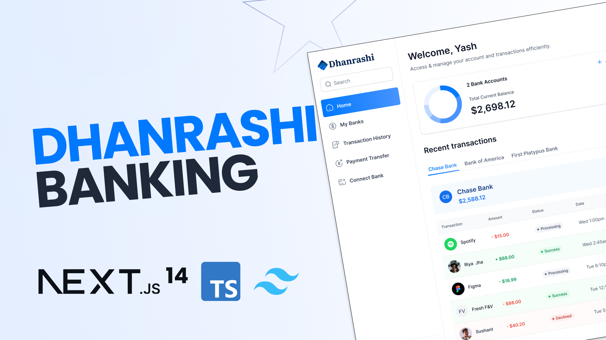
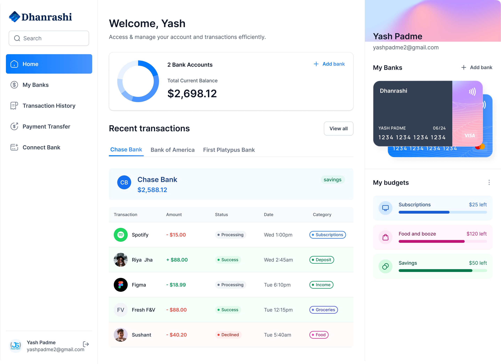
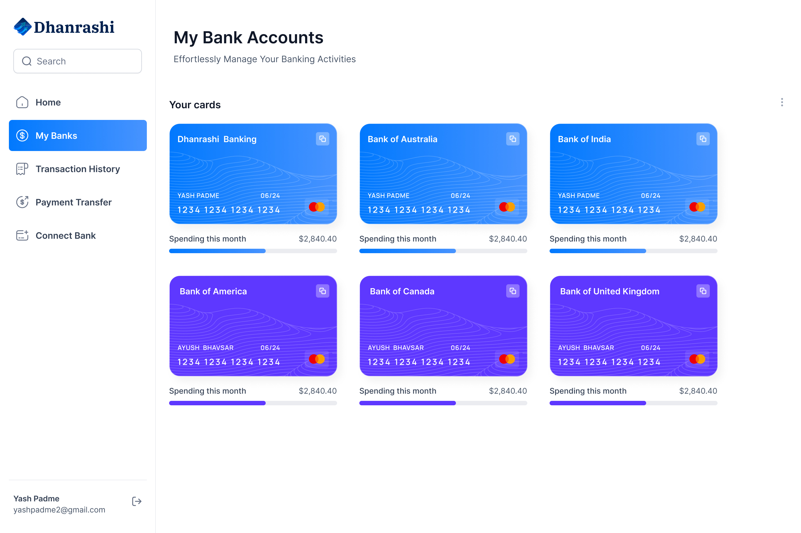
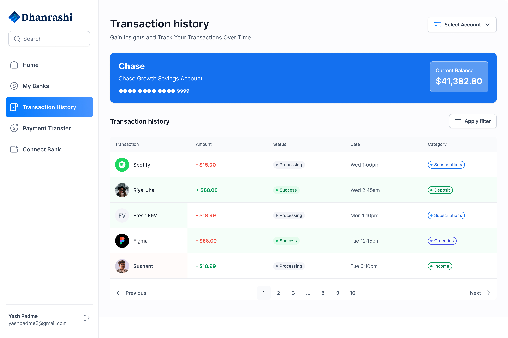
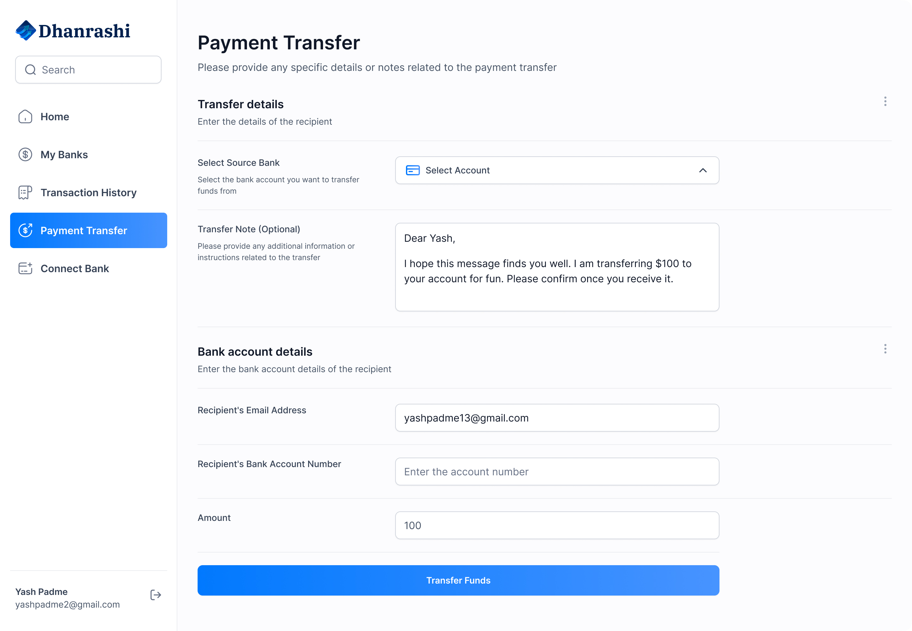
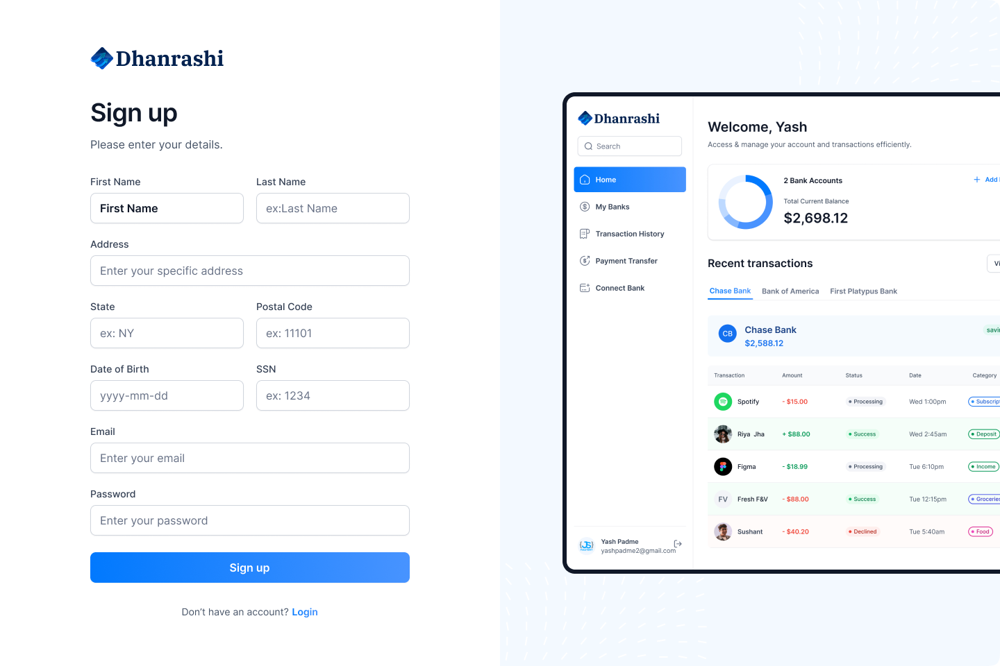

# 💸 Dhanrashi – Your Personal Financial SaaS Platform

**Dhanrashi** is a modern financial SaaS platform built with **Next.js**, **TypeScript**, and **Appwrite**. It allows users to securely connect multiple bank accounts, visualize and track transactions in real-time, and transfer money to other users using Dwolla — all from a single unified dashboard.



---

## 📌 Table of Contents

- [⚙️ Tech Stack](#tech-stack)
- [🔋 Features](#features)
- [📸 Screenshots](#screenshots)
- [📁 Folder Structure](#folder-structure)
- [🚀 Getting Started](#getting-started)

---

## ⚙️ Tech Stack

- **Frontend Framework**: Next.js (App Router)
- **Language**: TypeScript
- **Authentication & BaaS**: Appwrite
- **Bank Integrations**: Plaid (fetch data), Dwolla (money transfers)
- **Form Handling**: React Hook Form + Zod
- **Styling**: TailwindCSS
- **Charts & Graphs**: Chart.js
- **UI Library**: ShadCN

---

## 🔋 Features

- **🔐 SSR Authentication**  
  Fully secure authentication system using Appwrite with route protection and user validation.

- **🏦 Connect Multiple Banks**  
  Integration with **Plaid** to securely link and pull real-time banking data.

- **📊 Real-time Dashboard**  
  Dashboard includes:
  - Total Balance
  - Category-wise Spending
  - Latest Transactions
  - Income vs Expense Charts

- **🏛 My Banks**  
  View all connected bank accounts, their types, and current balances.

- **📁 Transaction History**  
  Paginated, filterable, and searchable transactions per account and date range.

- **💸 Fund Transfers via Dwolla**  
  Transfer funds between users using validated form fields and recipient bank IDs.

- **📱 Mobile-Friendly UI**  
  100% responsive design using TailwindCSS, optimized for all screen sizes.

- **🧠 Developer-Friendly**  
  Modular codebase with:
  - Reusable components
  - Global context management
  - Custom hooks and clean API abstraction

---
## 📸 Screenshots

> _Screenshots are stored in `/screenshots/` `._

| Dashboard | My Banks | Transactions |
|-----------|----------|---------------|
|  |  |  |

| Fund Transfer | Login | Signup |
|---------------|--------|--------|
|  |  |  |

---

## 📁 Folder Structure

Here’s the structure of your monorepo as per your current project layout:

```bash
├── app/                          # App Router structure (Next.js 13+)
│   ├── auth/                     # Sign In / Sign Up pages
│   │   ├── sign-in/
│   │   └── sign-up/
│   ├── my-banks/                 # List of linked banks
│   ├── payment-transfer/         # Fund transfer UI
│   ├── transaction-history/      # Paginated transaction log
│   ├── api/                      # Custom Next.js API routes
│   ├── global-error.tsx         # App-level error boundary
│   ├── globals.css              # Global styles
│   └── layout.tsx               # Root layout wrapper
│
├── components/                   # Reusable UI components
├── constants/                    # Static constants and enums
├── context/                      # Global state via Context API
├── hooks/                        # Custom React hooks
├── lib/                          # Helpers, Zod schemas, utilities
├── public/
│   └── screenshots/              # Images used in README
├── types/                        # TypeScript types and interfaces
├── .env                          # Main environment file
├── .env.example                  # Template for .env
├── .gitignore
├── next.config.js
├── postcss.config.js
├── tailwind.config.ts
├── tsconfig.json
├── package.json
└── README.md                     # This file
